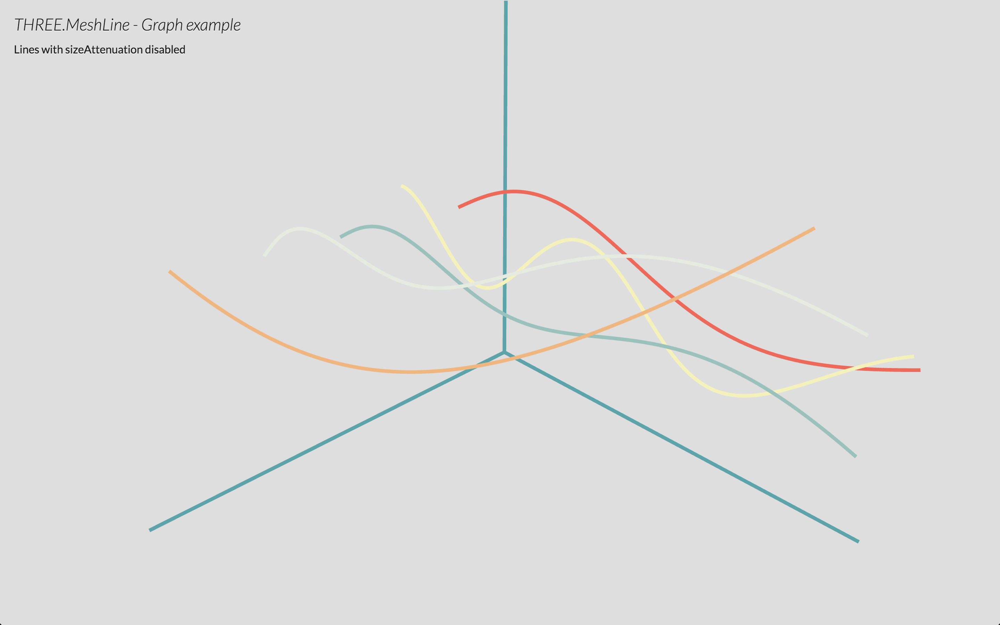
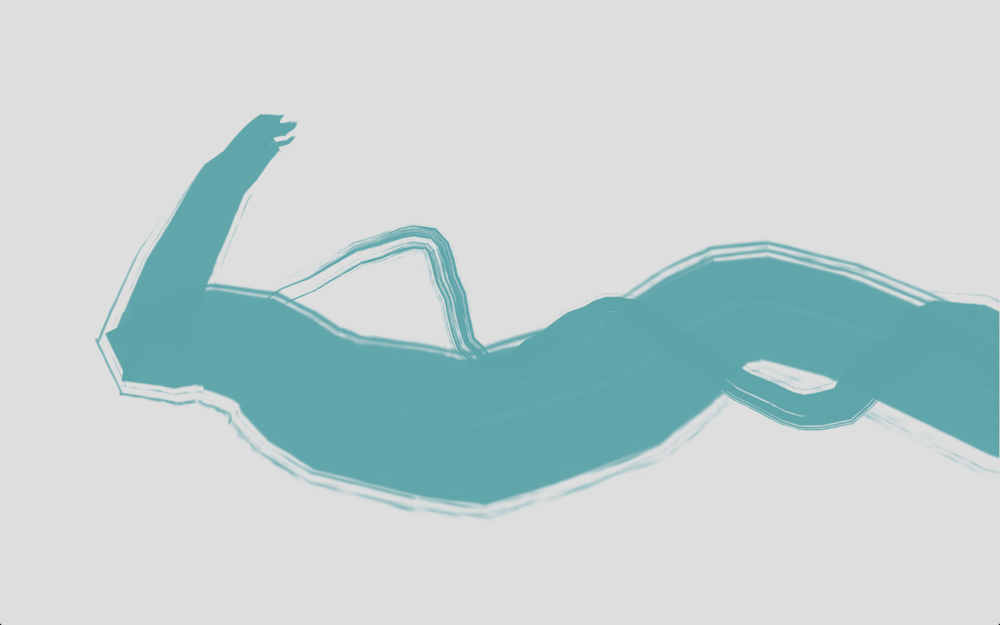
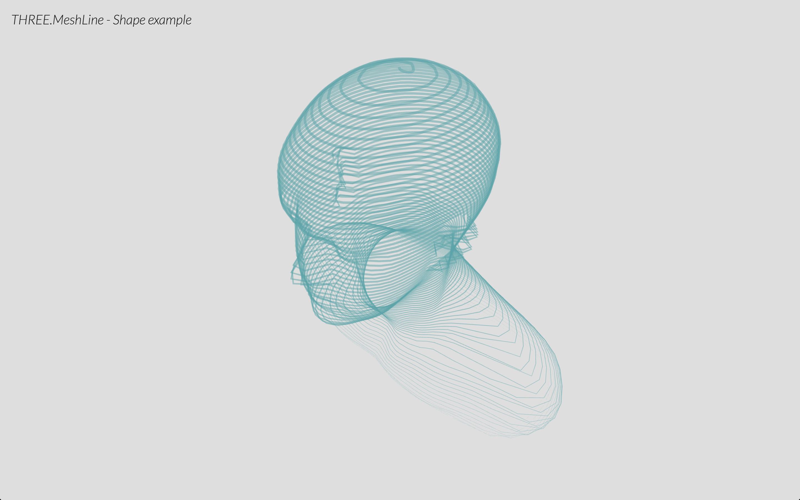

# MeshLine
Mesh replacement for ```THREE.Line```

Instead of using GL_LINE, it uses a strip of triangles billboarded. Some examples:

[](https://www.clicktorelease.com/code/THREE.MeshLine/demo/index.html)
[](https://www.clicktorelease.com/code/THREE.MeshLine/demo/graph.html)
[](https://www.clicktorelease.com/code/THREE.MeshLine/demo/spinner.html)
[](https://www.clicktorelease.com/code/THREE.MeshLine/demo/svg.html)
[](https://www.clicktorelease.com/code/THREE.MeshLine/demo/shape.html)
[](https://www.clicktorelease.com/code/THREE.MeshLine/demo/birds.html)

* [Demo](https://www.clicktorelease.com/code/THREE.MeshLine/demo/index.html): play with the different settings of materials
* [Graph](https://www.clicktorelease.com/code/THREE.MeshLine/demo/graph.html): example of using ```MeshLine``` to plot graphs
* [Spinner](https://www.clicktorelease.com/code/THREE.MeshLine/demo/spinner.html): example of dynamic ```MeshLine``` with texture
* [SVG](https://www.clicktorelease.com/code/THREE.MeshLine/demo/svg.html): example of ```MeshLine``` rendering SVG Paths
* [Shape](https://www.clicktorelease.com/code/THREE.MeshLine/demo/shape.html): example of ```MeshLine``` created from a mesh
* [Birds](https://www.clicktorelease.com/code/THREE.MeshLine/demo/birds.html): example of ```MeshLine.advance()``` by @caramelcode (Jared Sprague) and @mwcz (Michael Clayton)

### How to use ####

* Include script
* Create and populate a geometry
* Create a MeshLine and assign the geometry
* Create a MeshLineMaterial
* Use MeshLine and MeshLineMaterial to create a THREE.Mesh

#### Include the script ####

Include script after THREE is included
```js
<script src="THREE.MeshLine.js"></script>
```
or use npm to install it
```
npm i three.meshline
```
and include it in your code (don't forget to require three.js)
```js
var THREE = require( 'three' );
var MeshLine = require( 'three.meshline' ).MeshLine;
var MeshLineMaterial = require( 'three.meshline' ).MeshLineMaterial;
var MeshLineRaycast = require( 'three.meshline' ).MeshLineRaycast;
```
or
```js
import * as THREE from 'three';
import { MeshLine, MeshLineMaterial, MeshLineRaycast } from 'three.meshline'
```

##### Create and populate a geometry #####

First, create the list of vertices that will define the line. `MeshLine` accepts an array of vertices.

```js
const vertices = []
for (let j = 0; j < Math.PI; j += (2 * Math.PI) / 100)
  vertices.push(new THREE.Vector3(Math.cos(j), Math.sin(j), 0))
```

##### Create a MeshLine and assign the geometry #####

Once you have that, you can create a new `MeshLine`, and call `.setPoints()` passing the vertices.

```js
const line = new MeshLine()
line.setPoints(vertices)
```

Note: `.setPoints` accepts a second parameter, which is a function to define the width in each point along the line. By default that value is 1, making the line width 1 \* lineWidth in the material.

```js
// p is a decimal percentage of the number of points
// ie. point 200 of 250 points, p = 0.8
line.setPoints(geometry, p => 2) // makes width 2 * lineWidth
line.setPoints(geometry, p => 1 - p) // makes width taper
line.setPoints(geometry, p => 2 + Math.sin(50 * p)) // makes width sinusoidal
```

##### Create a MeshLineMaterial #####

A ```MeshLine``` needs a ```MeshLineMaterial```:

```js
var material = new MeshLineMaterial(OPTIONS);
```

By default it's a white material of width 1 unit.

```MeshLineMaterial``` has several attributes to control the appereance of the ```MeshLine```:

* ```map``` - a ```THREE.Texture``` to paint along the line (requires ```useMap``` set to true)
* ```useMap``` - tells the material to use ```map``` (0 - solid color, 1 use texture)
* ```alphaMap``` - a ```THREE.Texture``` to use as alpha along the line (requires ```useAlphaMap``` set to true)
* ```useAlphaMap``` - tells the material to use ```alphaMap``` (0 - no alpha, 1 modulate alpha)
* ```repeat``` - THREE.Vector2 to define the texture tiling (applies to map and alphaMap - MIGHT CHANGE IN THE FUTURE)
* ```color``` - ```THREE.Color``` to paint the line width, or tint the texture with
* ```opacity``` - alpha value from 0 to 1 (requires ```transparent``` set to ```true```)
* ```alphaTest``` - cutoff value from 0 to 1
* ```dashArray``` - the length and space between dashes. (0 - no dash)
* ```dashOffset``` - defines the location where the dash will begin. Ideal to animate the line.
* ```dashRatio``` - defines the ratio between that is visible or not (0 - more visible, 1 - more invisible).
* ```resolution``` - ```THREE.Vector2``` specifying the canvas size (REQUIRED)
* ```sizeAttenuation``` - makes the line width constant regardless distance (1 unit is 1px on screen) (0 - attenuate, 1 - don't attenuate)
* ```lineWidth``` - float defining width (if ```sizeAttenuation``` is true, it's world units; else is screen pixels)

If you're rendering transparent lines or using a texture with alpha map, you should set ```depthTest``` to ```false```, ```transparent``` to ```true``` and ```blending``` to an appropriate blending mode, or use ```alphaTest```.

##### Use MeshLine and MeshLineMaterial to create a THREE.Mesh #####

Finally, we create a mesh and add it to the scene:

```js
const mesh = new THREE.Mesh(line, material)
scene.add(mesh)
```

You can optionally add raycast support with the following.

```js
mesh.raycast = MeshLineRaycast
```

### Declarative use ###

three.meshline can be used declaritively. This is how it would look like in react/[react-three-fiber](https://github.com/drcmda/react-three-fiber). You can try it live [here](https://codesandbox.io/s/react-three-fiber-three.meshline-example-vl221).

<p align="center">
	<a href="https://codesandbox.io/s/react-three-fiber-threejs-meshline-example-vl221"></a>
	<a href="https://codesandbox.io/s/threejs-meshline-custom-spring-3-ypkxx"></a>
</p>

```jsx
import { extend, Canvas } from 'react-three-fiber'
import { MeshLine, MeshLineMaterial, MeshLineRaycast } from 'three.meshline'

extend({ MeshLine, MeshLineMaterial })

function Line({ points, width, color }) {
  return (
    <Canvas>
      <mesh raycast={MeshLineRaycast}>
        <meshLine attach="geometry" points={points} />
        <meshLineMaterial
          attach="material"
          transparent
          depthTest={false}
          lineWidth={width}
          color={color}
          dashArray={0.05}
          dashRatio={0.95}
        />
      </mesh>
    </Canvas>
  )
}
```

### TODO ###

* Better miters
* Proper sizes

### Support ###

Tested successfully on

* Chrome OSX, Windows, Android
* Firefox OSX, Windows, Anroid
* Safari OSX, iOS
* Internet Explorer 11 (SVG and Shape demo won't work because they use Promises)
* Opera OSX, Windows

### References ###

* [Drawing lines is hard](http://mattdesl.svbtle.com/drawing-lines-is-hard)
* [WebGL rendering of solid trails](http://codeflow.org/entries/2012/aug/05/webgl-rendering-of-solid-trails/)
* [Drawing Antialiased Lines with OpenGL](https://www.mapbox.com/blog/drawing-antialiased-lines/)

#### License ####

MIT licensed

Copyright (C) 2015-2016 Jaume Sanchez Elias, http://www.clicktorelease.com